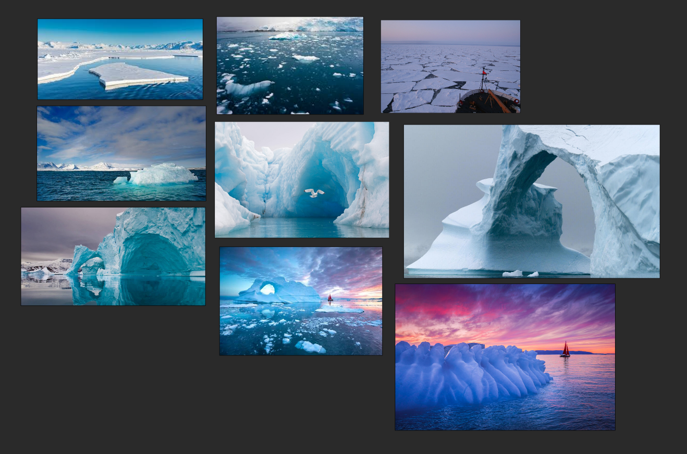

# DEV-02, Reference Sheet
### Tags: []
### Link:[<https://academy.cgboost.com/courses/master-3d-environments-in-blender/lectures/28833150>]

## Gather references and put them on PureRef

## Desert (day)

## Desert (Dusk)

## Desert (Night)

## Desert (With boulders)

## Desert (With ocean)

## Ocean (Surface)

## Ocean (Deep 1)

## Ocean (Deep 2)

## Ocean (Plants)

## Ice Caves

## Ice Lands

## Frozen Sea Side (Day)

## Frozen Sea Side (Night)

## Mountain Side

## Forest

## Fog Forest

## Craters

## Calderas

