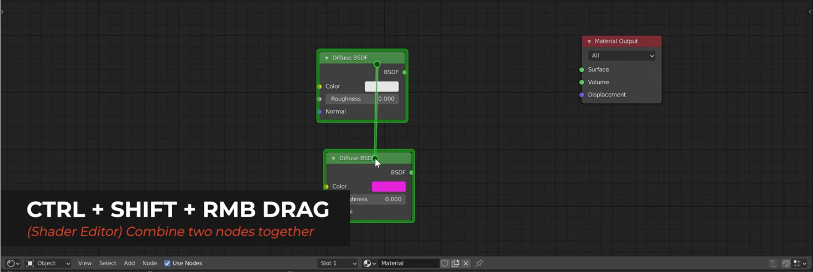

# DEV-04, Node Wrangler Operations
### Tags: []
### Link:[<https://academy.cgboost.com/courses/master-3d-environments-in-blender/lectures/32577596>]

## Combining Nodes

## Cutting Node connections

## Reroute node

## Mapping Network

## Preview node

## Math operations

## Adding multiple textures to the Principle BSDF Shader

