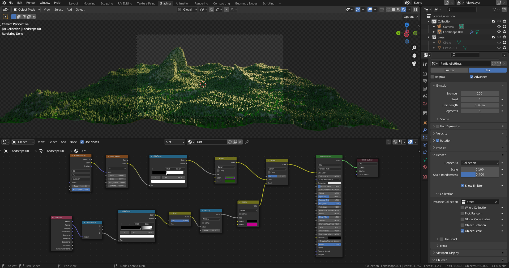

# DEV-06, Basics Particle Set up
### Tags: []
### Link:[<https://academy.cgboost.com/courses/master-3d-environments-in-blender/lectures/32577650>]

## Using weight maps

  This might be useful for making hair or fur coats

## resources
<https://polyhaven.com/a/spruit_sunrise>
<https://www.blendswap.com/blend/16492>
