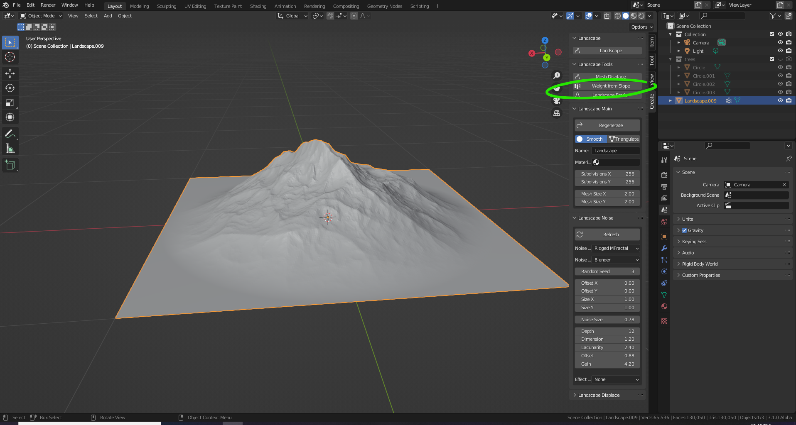

# DEV-08, Using A.N.T (Another Noise Tool)
### Tags: [uv unwrapping]
### Link:[<https://academy.cgboost.com/courses/master-3d-environments-in-blender/lectures/29431127>]

## Create ANT and weight map

## UV unwrap

