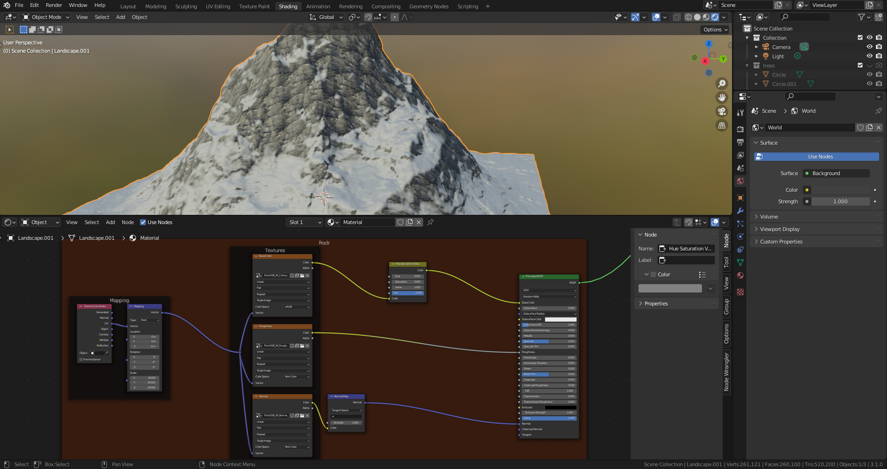

# DEV-12, Adding Second rock material
### Tags: []
### Link:[<https://academy.cgboost.com/courses/master-3d-environments-in-blender/lectures/29431168>]

## Decrease the Hue of the current rock texture

## Fuse multiple rock types

## resources

  stripped rock

<https://ambientcg.com/view?id=Rock033>

  blue rock

<https://ambientcg.com/view?id=Rock035>
